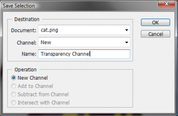
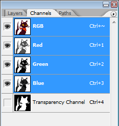
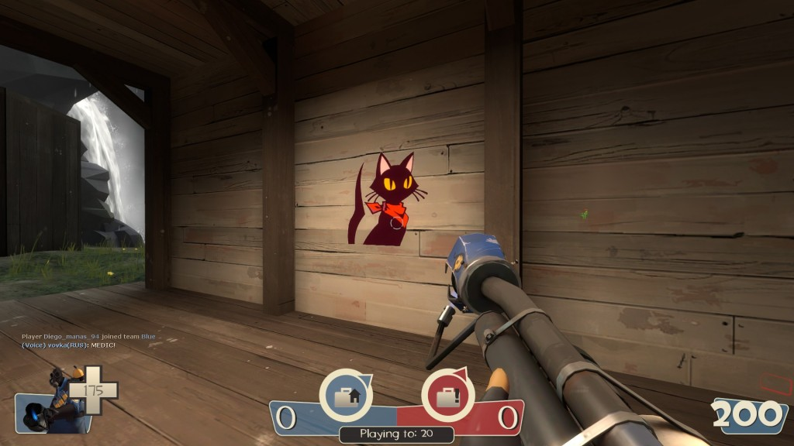

Alpha Channels. I’ve wasted many hours in the past researching them, finding incorrect guides, finally figuring them out, and then promptly forgetting and repeating the process 6 months later. Thus its in prime position for transcribing.

Essentially, alpha channels allow you to create transparent sections in images (in my case likely TARGAs for use in certain Source Engine-based games…). I’ll be focusing on the process using Adobe Photoshop CS2 in this post.

### Going through the Motions

Before creating the channel, some preparation may need to be done with the image. Ideally the desired non-transparent section(s) will be in stark contrast to the background, which should be of a single colour. This is because we’ll be using the Magic Wand Tool to intelligently select this section, essentially doing all the work for us.
Alternatively the Magnetic Lasso Tool can be used to manually trace around the desired image, but it’s much easier just to have a different background.

That’s why I’ve chosen the following image as the example.

The black against the white background should mean that the Magic Wand Tool has no problem at all selecting only the parts that we want.

### 1. Select the Background

First choose the Magic Wand tool and select the background.

By selecting the background, we can almost always ensure that all relevant parts will be selected (with a caveat, as we can see below).

The initial result is as follows:

As you may be able to make out, the small section of background next to the head hasn’t been selected, as it doesn’t connect directly to the rest. Shift-clicking it will add it to the current selection.

### 2. Inverse the Selection

This one’s simple. Use CTRL + SHIFT + I to select the inverse of the current selection. This is what’ll be used to make the channel.

Note that alternatively we could have used the Magic Wand Tool to select all parts of the cat in step one, and not needed this step. Realistically though, with most images the desired non-transparent area will be made up of multiple colours that all have to be selected/identified by the Magic Wand, so its easier to just inverse the background selection.

### 3. Create the Channel

With the cat selected, right-click anywhere on the image and choose ‘Save Selection…’ from the context menu.

Click OK and the channel should be all set up. You can confirm this by clicking ‘channels’ in the Layers Window. The new channel should be shown.

### 4. Save and Test

Save and test! The image should be saved as a .tga with a 32 bits/pixel resolution.

And the result:

Success!

### Conclusion

So, in summary:

-   Set up a background in stark contrast to the desired image (e.g. white).
-   Use the Magic Wand Tool to select the background.
-   Use CTRL-SHIFT-I to inverse the selection.
-   Right-click anywhere on the image and select ‘Save Selection…’.
-   Save the file as a 32bits/pixel .tga.
-   Take a satisfactory sip of your favourite beverage, safe in the knowledge of a job well done.

And there we have it. One alpha-channeled image, and a description of how to create it.

Thanks for reading!
