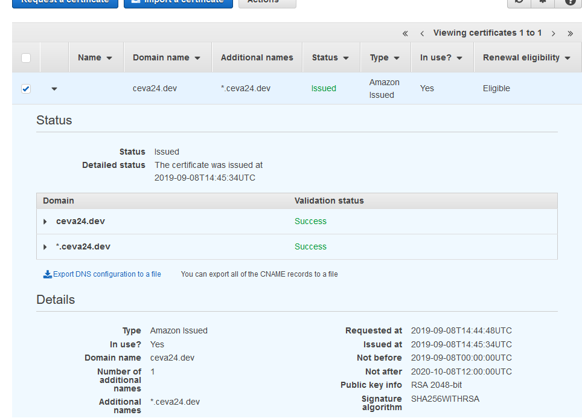
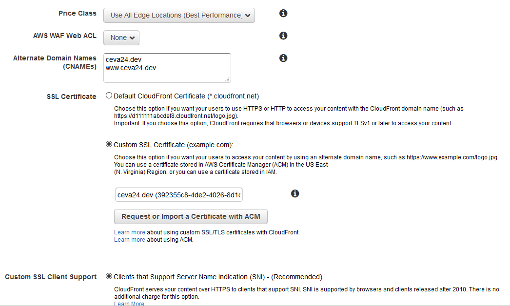

_Update 2021-06-19: This solution still works perfectly well and gives you lots of control over the individual services, but if you're looking for a straightforward way to host a static website I'd recommend using [AWS Amplify](https://aws.amazon.com/amplify/) - it guides you through the entire process and uses all of the same AWS services under the hood (S3, CloudFront etc.), it just removes all of the complexity. It also hooks up to your Git repo so you can enable continuous deployment without needing to write CDK or similar._

---

I've just switched to a `.dev` domain and wanted to host a website on [Amazon S3](https://aws.amazon.com/s3/), however all of the guides I could find assume you're going to use Amazon's own Route 53 rather than the Google Domains nameservers to achieve this.
I wanted to keep using Google's nameservers as it's more cost-effective and I can use the super-simple email forwarding feature. I did figure out how to do all this in the end, and this post will explain how.

One thing to mention is that this solution requires the website to be hosted at the `www` subdomain, which we then configure the apex domain to redirect to
(e.g. [https://ceva24.dev](https://ceva24.dev) -> [https://www.ceva24.dev](https://www.ceva24.dev)).

### Purchase a Domain

Purchase a domain on Google Domains. Under DNS, don't change the nameservers, keep DNSSEC enabled and feel free to [set up email forwarding](https://support.google.com/domains/answer/3251241).

### Create an S3 Bucket

[Create an S3 bucket for static website hosting](https://docs.aws.amazon.com/AmazonS3/latest/dev/WebsiteHosting.html) and upload your website content, or an `index.html` for a now.
The bucket name should be the name of your domain including the `www` subdomain, in my case `www.ceva24.dev`.

If you're hosting a website that uses client-side routing e.g. React Router then you should also configure the Error document to be the same as the Index document.

**At this point you should be able to access your website via the S3 static website hosting URL**!

_Note_: Google's `.dev` domains use [HSTS](https://security.googleblog.com/2017/09/broadening-hsts-to-secure-more-of-web.html), which means you can't point your domain name to the S3 bucket
as a test at this point - you have to complete all of the steps in this guide for it to work.

### Create an SSL Certificate

If you're hosting a website on S3 the easiest way to make your website secure is to use the [AWS Certificate Manager](https://aws.amazon.com/certificate-manager/) to create and manage your SSL certificate for you. This is free.

Follow [the guide to request a public certificate](https://docs.aws.amazon.com/acm/latest/userguide/gs-acm-request-public.html#request-public-console). The cerficate should be for the root and all subdomains,
the way I did this was to configure `ceva24.dev` as the domain name and `*.ceva24.dev` as an additional domain name.

As part of setting up your certificate you'll have to verify to Amazon that you own the address by [adding a CNAME record](https://support.google.com/domains/answer/9211383) in Google Domains with the name and data that AWS provides.

### Configure Cloudfront

Create a web distribution using Cloudfront. After hitting numerous Access Denied errors I discovered that _the origin domain name should be the static website URL from S3, not the S3 bucket name that appears in the autocomplete list_.
There's an [AWS guide that goes into further detail](https://aws.amazon.com/premiumsupport/knowledge-center/s3-website-cloudfront-error-403/) about this, and also provides other possible solutions.

Under 'Default Cache Behavior Settings' change the 'Viewer Protocol Policy' to be 'Redirect HTTP to HTTPS' (credit to Charles Eldridge for reminding me about this!).

Under 'Alternate Domain Names (CNAMEs)' enter both your apex domain and `www` subdomain. Immediately after under 'SSL Certificate' select 'Custom SSL Certificate' and choose your ACM certificate in the drop-down.

You can leave all other options as default and create the Distribution.

**At this point you should be able to access your website via the Cloudfront Distribution URL!**

### Configure Google Domains to Point to your Cloudfront Distribution

Now we can point the Google Domains nameservers to your Cloudfront Distribution. We do this via a CNAME record (which explains why we're not hosting the website at the apex domain, as CNAME records can't be for the root).

Add a CNAME record with name `www` pointing to your Cloudfront Distribution URL (this can be seen under 'Domain Name' in the Distribution's details). Google Domains will put a `.` at the end of the URL, this is normal.

Then we can use Google Domains subdomain forwarding to redirect the apex domain to `www`:

Under Synthetic Records add a subdomain forward from `@` (the root) to your secure `www` subdomain, so in my case `https://www.ceva24.dev`. You also probably want to enable 'Forward path'.

**At this point you should be able to access your website via your domain name!**

### Wrapping Up

And that's it! We now have a website hosted in S3 and routed via Google Domains nameservers.

Thanks for reading!
